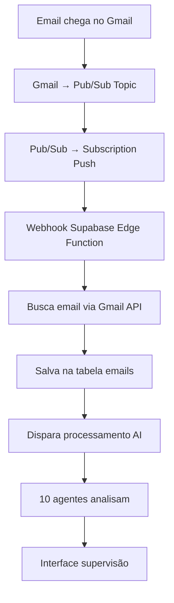

# 🔗 Configuração Completa do Webhook Gmail

## Pré-requisitos
- ✅ Google Cloud Project criado
- ✅ Gmail API ativada
- ✅ Pub/Sub API ativada
- ✅ OAuth 2.0 configurado

## 📋 Passo a Passo

### 1. **Criar Topic no Pub/Sub**
```bash
# No Google Cloud Console:
1. Vá para Pub/Sub → Topics
2. Clique em CREATE TOPIC
3. Topic ID: gmail-webhook-topic
4. Clique em CREATE
```

### 2. **Criar Subscription Push**
```bash
# Dentro do topic criado:
1. Clique em CREATE SUBSCRIPTION
2. Subscription ID: gmail-webhook-subscription
3. Delivery type: Push
4. Endpoint URL: https://nsbjkxbfkhauitmjnkxh.supabase.co/functions/v1/gmail-webhook
5. Acknowledgment deadline: 600 seconds
6. Clique em CREATE
```

### 3. **Configurar Permissões IAM**
```bash
# No Google Cloud Console:
1. Vá para IAM & Admin → IAM
2. Clique em GRANT ACCESS
3. New principals: gmail-api-push@system.gserviceaccount.com
4. Role: Pub/Sub Publisher
5. Clique em SAVE
```

### 4. **Obter Project ID**
```bash
# No Google Cloud Console:
1. Clique no nome do projeto no topo
2. Copie o PROJECT ID (não o nome)
3. Anote este valor
```

### 5. **Configurar Watch no Gmail**

Use esta Edge Function para ativar o watch:
```
POST https://nsbjkxbfkhauitmjnkxh.supabase.co/functions/v1/setup-gmail-watch
```

**Payload:**
```json
{
  "email_address": "seu-email@gmail.com",
  "access_token": "seu_access_token_oauth"
}
```

**IMPORTANTE:** Substitua `YOUR_PROJECT_ID` na função pelo seu Project ID real.

### 6. **Testar Webhook**

1. **Envie um email de teste** para a conta configurada
2. **Verifique os logs** no Supabase:
   ```
   Dashboard → Project → Edge Functions → gmail-webhook → Logs
   ```
3. **Verifique a tabela emails**:
   ```sql
   SELECT * FROM emails ORDER BY created_at DESC LIMIT 5;
   ```

### 7. **Fluxo Completo**



### 8. **Variáveis de Ambiente Necessárias**

No Supabase Edge Functions, configure:
```env
GOOGLE_CLIENT_ID=seu_client_id
GOOGLE_CLIENT_SECRET=seu_client_secret
GOOGLE_PROJECT_ID=seu_project_id
GMAIL_WEBHOOK_URL=https://nsbjkxbfkhauitmjnkxh.supabase.co/functions/v1/gmail-webhook
```

### 9. **Troubleshooting**

**Webhook não recebe notificações:**
- Verifique se o watch está ativo (expira em 7 dias)
- Confirme as permissões IAM
- Teste o endpoint manualmente

**Emails não são processados:**
- Verifique os logs da Edge Function
- Confirme se o access_token está válido
- Teste a Gmail API diretamente

**Erro 404 na subscription:**
- Confirme se a URL do endpoint está correta
- Verifique se a Edge Function foi deployada

### 10. **Renovação Automática**

O watch expira em 7 dias. Para renovação automática, configure um cron job que chama:
```
POST /functions/v1/setup-gmail-watch
```

## ✅ Checklist Final

- [ ] Topic Pub/Sub criado
- [ ] Subscription configurada
- [ ] Permissões IAM definidas
- [ ] Project ID anotado
- [ ] Watch ativado via Edge Function
- [ ] Teste de webhook realizado
- [ ] Emails sendo processados
- [ ] Interface de supervisão funcionando

## 🔧 Próximos Passos

1. **Deploy no Vercel** com as variáveis de ambiente
2. **Configurar OAuth** com URLs do Vercel
3. **Testar integração completa**
4. **Configurar renovação automática** do watch 

## 🔍 **Você está na página errada!**

Vejo que você está no **Security Command Center** (Centro de Comando de Segurança), mas precisa ir para a seção **IAM** para adicionar as permissões.

## 🧭 **Como navegar para o local correto:**

### **Método 1: Menu de Navegação**
1. **Clique no menu hambúrguer** (☰) no canto superior esquerdo
2. **Role para baixo** até encontrar **"IAM e administrador"**
3. **Clique em** `IAM e administrador` → `IAM`

### **Método 2: URL Direta**
**Copie e cole esta URL no seu navegador:**
```
https://console.cloud.google.com/iam-admin/iam?authuser=1&hl=pt-br&project=sonnar-email-integration
```

### **Método 3: Busca Rápida**
1. **Na barra de busca** do Google Cloud Console (no topo)
2. **Digite:** `IAM`
3. **Clique no resultado** "IAM e administrador"

## 📝 **Quando chegar na página IAM:**

A página vai mostrar:
- **Título:** "IAM" 
- **Botão azul:** `+ CONCEDER ACESSO`
- **Lista de principais** e suas funções

## 🎯 **Então faça:**
1. **Clique em** `+ CONCEDER ACESSO`
2. **Em "Novos principais":** `gmail-api-push@system.gserviceaccount.com`
3. **Em "Função":** Busque por `Pub/Sub Publisher`
4. **Clique em** `SALVAR`

## ⚠️ **Se der o mesmo erro de política:**

Significa que o projeto `sonnar-email-integration` também tem **restrições organizacionais**. Nesse caso, vamos usar a **Opção 3 (Polling)** que mencionei antes, que **não precisa dessas permissões especiais**.

**Conseguiu navegar para a página IAM?** Se der o mesmo erro, me avise que implemento o sistema de polling! 🚀 